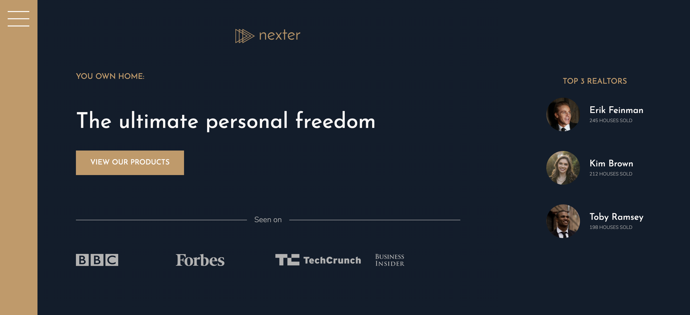
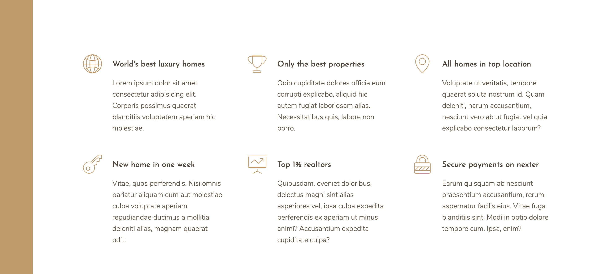
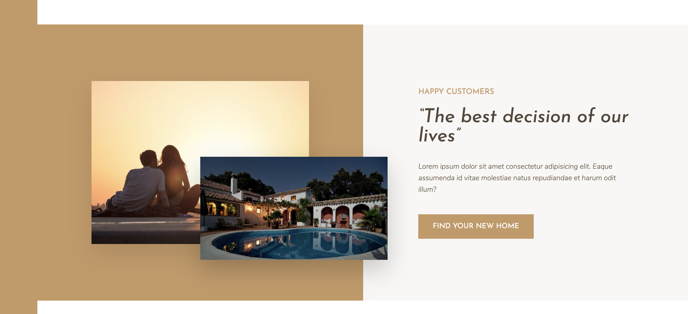

# nexter

## Live Demo

The live demo can be accessed at [victorbruce.github.io/nexter](https://victorbruce.github.io/nexter/)

## Table of Content
- [About The App](#about-the-app)
- [Screenshots](#screenshots)
- [Technologies](#technologies)
- [Setup](#setup)
- [Approach](#approach)
- [Status](#status)
- [Credits](#credits)
- [License](#license)

## About The App

nexter is a clone of Jonas Shemdit cousre advance css and sass. nexter is a website for a fictional real estate development company who are into building and selling luxurious homes.
This project focuses on how to use css-grids to build complete page layouts. I had some struggles using css grids. This project has helped me to get comfortable using css-grids with flexbox to build responsive web pages.

## Screenshots

## Technologies

- html5
- Sass
- CSS3

## Setup

1. clone the project from [github.com/victorbruce/nexter](https://github.com/victorbruce/nexter)
2. In your terminal or command line, run the command git clone `repository link`
3. cd into the project and install the necessary packages by running the command `npm install`
4. After the installation is complete, run the command `npm start` to run the project in development mode.

## Approach

I used: 
- css processor library sass to help me write resuable css code styles by defining **variables**, **mixins** and **functions**; Maintain clean code through nesting.
- **7-in-1 folder structure architecture** for organising my files and folders
- **BEM(Block, Element, Modify)** for my class names
- **css-grids**, **flex-box** and some **media query** rules for responsive design

## Status

`Completed`.

## Credits

- [Jonas Schmedtmann](https://github.com/jonasschmedtmann)
- [Advance Css and Sass course](https://www.udemy.com/course/advanced-css-and-sass/)

## License

No license